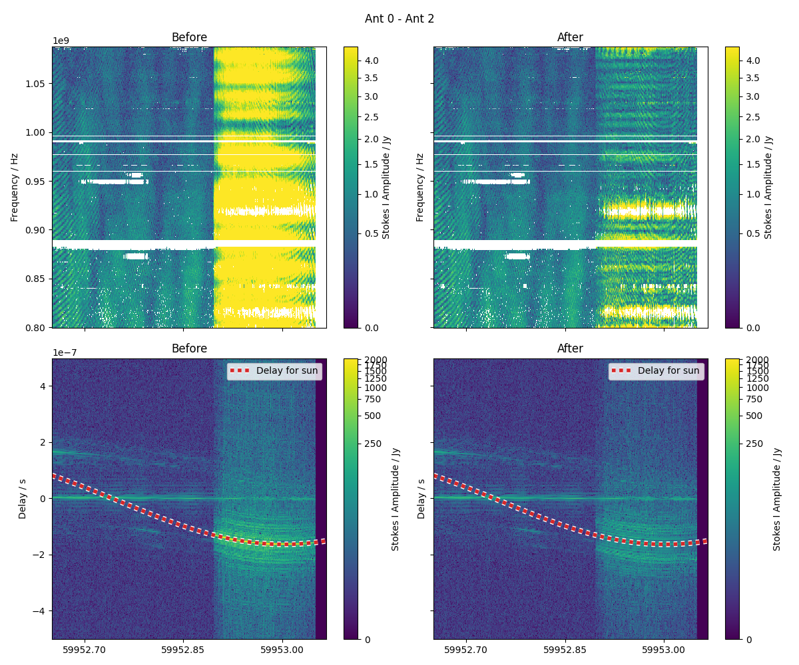
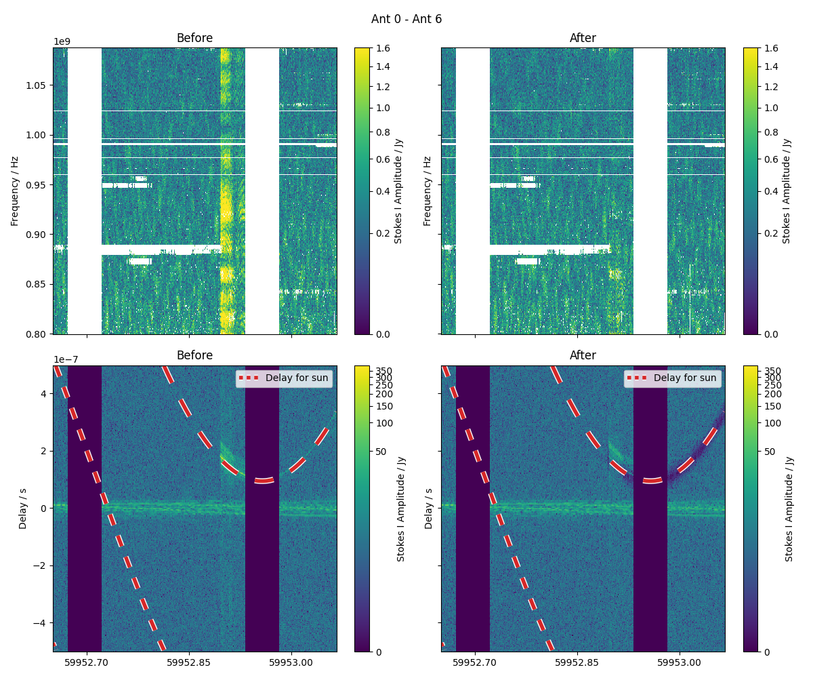

# jolly-roger

[![Actions Status][actions-badge]][actions-link]
[![Documentation Status][rtd-badge]][rtd-link]

[![PyPI version][pypi-version]][pypi-link]
<!-- [![Conda-Forge][conda-badge]][conda-link] -->
[![PyPI platforms][pypi-platforms]][pypi-link]

<!-- [![GitHub Discussion][github-discussions-badge]][github-discussions-link] -->

<!-- SPHINX-START -->

<!-- prettier-ignore-start -->
[actions-badge]:            https://github.com/flint-crew/jolly-roger/workflows/CI/badge.svg
[actions-link]:             https://github.com/flint-crew/jolly-roger/actions
[conda-badge]:              https://img.shields.io/conda/vn/conda-forge/jolly-roger
[conda-link]:               https://github.com/conda-forge/jolly-roger-feedstock
[github-discussions-badge]: https://img.shields.io/static/v1?label=Discussions&message=Ask&color=blue&logo=github
[github-discussions-link]:  https://github.com/flint-crew/jolly-roger/discussions
[pypi-link]:                https://pypi.org/project/jolly-roger/
[pypi-platforms]:           https://img.shields.io/pypi/pyversions/jolly-roger
[pypi-version]:             https://img.shields.io/pypi/v/jolly-roger
[rtd-badge]:                https://readthedocs.org/projects/jolly-roger/badge/?version=latest
[rtd-link]:                 https://jolly-roger.readthedocs.io/en/latest/?badge=latest

<!-- prettier-ignore-end -->

The pirate flagger!


# Installation

`pip install jolly-roger`

# About

This package attempts to flag or modify visibilities that are contaminated by the Sun (or potentially some other bright source). There are two main modes that are currently supported in `jolly-roger`.

The flags based on the projected baseline length should the array be tracking the Sun. The projected baseline length between some phased direction being tracked and the Sun can be significantly different. `jolly_roger` attempts to leverage this by only flagging data where the projected baseline length is between some nominal range that corresponds to angular scales associated with the Sun.

The second mode is the application of a notch filter in delay space, where the nulling is applied to the expected delay of the Sun for each timestep and baseline. This mode reads the data row-wise as it appears in the measurement set, so can be fast enough to apply to long-tracks ASKAP observations while also using a limited set of computing resources.

`jolly_roger` makes no guarentess about removing all contaminated visibilities, nor does it attempt to peel/subtract the Sun from the visibility data.

# Projected baseline flagging
## How does it work?

`jolly_roger` will recompute the (u,v,w)-coordinates of a measurement set as if it were tracking the Sun, from which (u,v)-distances are derieved for each baseline and timestep. An updated `FLAG` column can then be inserted into the measurement set suppressing visibilities that would be sensitive to a nominated range of angular scales. This mode also allows for flagging based on the elevation of the target source. 

## Example

`jolly_roger` has a CLI entry point for projected baseline flagging that can be called as:

```
jolly_flagger scienceData.EMU_1141-55.SB47138.EMU_1141-55.beam00_averaged_cal.leakage.ms --min-horizon-limit-deg '-2' --max-horizon-limit-deg 30 --min-scale-deg 0.075
```

Here we are flagging visibilities that correspond to instances where:
- the Sun has an elevation between -2 and 30 degrees, and
- they are sensitive to angular scales larger than 0.075 degrees.

# Delay nulling (notch filter)
## How it works

In this mode the frequency data of each timestep/baseline is Fourier transformed to form a delay spectrum. `jolly-roger` can null for delays away from zero (the tracked sky-position), or null the delays towards some nominated sky-direction. The expected delay of a bright source can be computed by examining the difference between the w-terms of the phased direction and the source direction. 

## Example

The nulling approach can be accessed through `jolly_tractor`. Examples of its application are below. 




The full set of command line options can be obtained with:

```
jolly_tractor --help
```