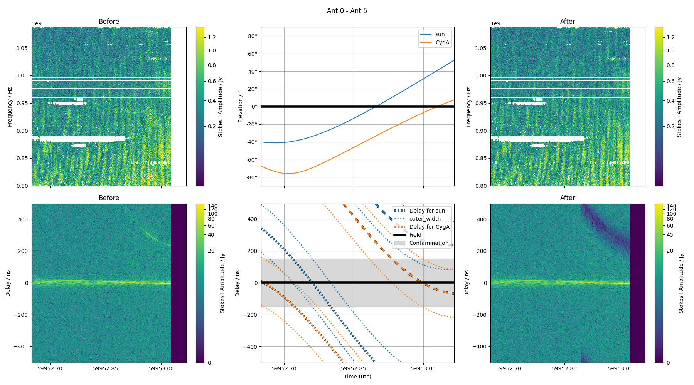
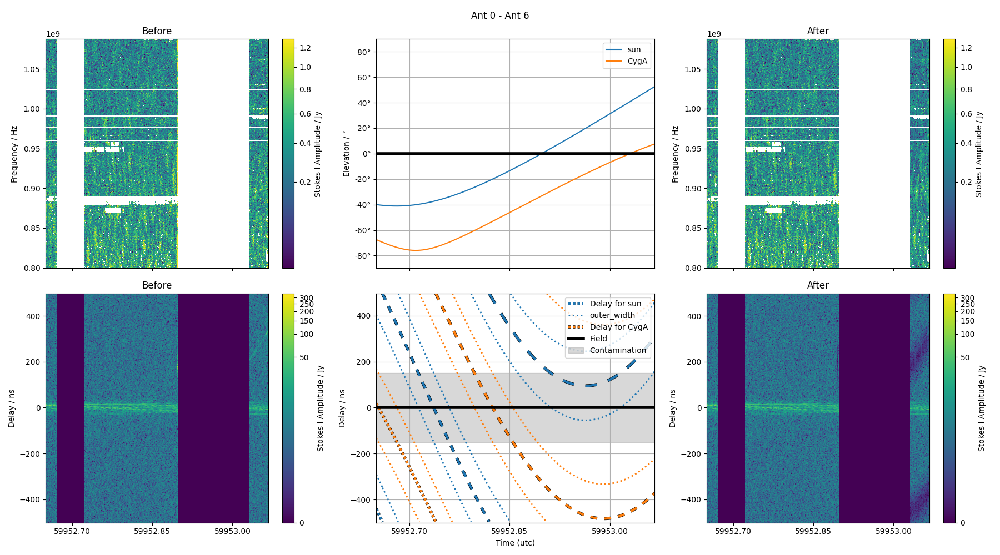
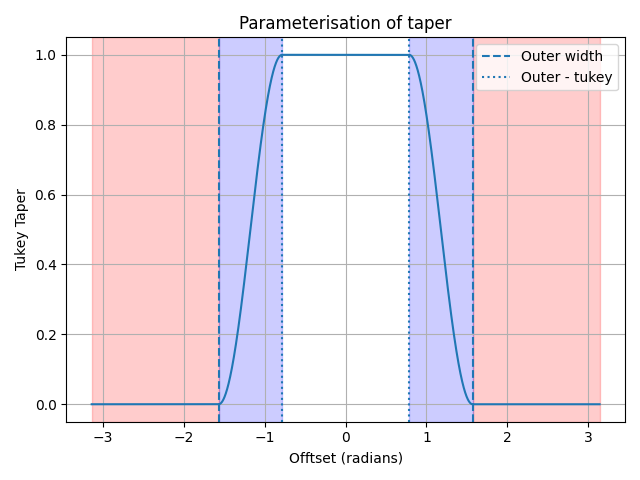
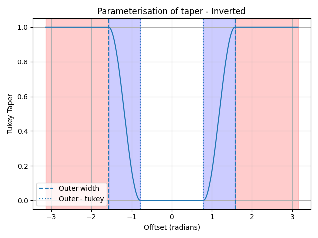

# Delay nulling (notch filter)
## How it works

In this mode the frequency data of each timestep/baseline is Fourier transformed to form a delay spectrum. `jolly-roger` will null the delays towards some nominated sky-direction. The expected delay of a bright source can be computed by examining the difference between the w-terms of the phased direction and the source direction. Multiple sky-directions may be set in a single `jolly-roger` invocation.

## Acceleration

The computation part of `jolly-roger` can be spread across multiple cores through data partitioning. This is mostly a best effort basis for the moment, but testing has shown upwards a 2-times speed up. On the command line the `--max-workers N` argument is used to set the number of threads (not processes) to use, where each thread is managing on compute operation against a chunk of rows.

Should this be used it is suggested to lower the `--chunk-size` to avoid excessive memory usage. Acceleration here relies on `numpy` operations releasing the GIL, so full CPU saturation is unlikely. Further, reading/writing through `casacore` is limited to the main thread, so can also act as a bottleneck.

Brief testing suggests that smaller batch sizes is preferable over larger when using `N > 4` number of workers, but this has not been thoroughly explored.

## Example

The nulling approach can be accessed through `jolly_tractor`. Examples of its application are below. The left and right columns indicate the before and after of the nulling procedure (here nulling towards the Sun's sky position). The top row shows the dynamic sopectrum (time vs frequency) while the bottom highlight the time vs delay of the data.

Sunrise was approximately in the middle of this observation, as indicated by the sudden excess power seen in the top left figure.

The red dashed lines in the lower panel represents the delay of the Sun as derived from the geometry of the array, with the length of each dash represents the Nyquist zone (i.e. how aliased the source appears in delay space). Nulling can be deactivated if the Nyquist zone of the object is high enough to effectively mean no contribution (typically the case for longer baselines).

Should the source cross over a delay of 0 then that timestep will be flagged, as the intermixed components can not be separated, and nulling would have an adverse effect of the direction being observed.

## Delay-rate filtering in the contaminated zone

Flagging the timesteps where the object crosses the field in delay can remove a considerable amount of data, particularly on short baselines. As the field is phase-tracked it sits near a fringe-rate of zero, while the object generally does not. With `--rate-filter` these timesteps are instead filtered in two dimensions, delay and delay-rate.

Two contamination zones are considered:

- **delay**: the object's delay is within the field's delay guard (the timesteps that are flagged as described above), and
- **delay-rate**: the object's delay-rate is within the field's delay-rate guard. With `--guard-field` this guard is derived from the nominal field-of-view radius $\theta$ as $\theta \lvert d(u,v)/dt \rvert / c$, mirroring the delay guard of $\theta \lvert (u,v) \rvert / c$. `--rate-filter-guard-hz` adds an absolute fringe-rate to protect.

A timestep contaminated in delay but not in delay-rate is recoverable. For each baseline, recoverable timesteps are collected as the object enters the delay contaminated zone. Once the object leaves (or enters the delay-rate contaminated zone) the collected segment is transformed to delay-rate space, a notch covering the object's footprint is applied, and the result is written back to the output column. The footprint follows the object across the segment: at each timestep it sits at the object's predicted delay (widened by `--outer-width-ns`) and spans the fringe-rates of the object across the band (widened by the delay-rate margin), so an object whose delay-rate changes during a segment is nulled along its path rather than across the box bounding it. The region around (delay, rate) = (0, 0) occupied by the field is never modified. Segments where the object's footprint would meet the field, or that are shorter than `--rate-filter-min-timesteps`, are left tapered and flagged.

As for `--ignore-nyquist-zone` in delay, `--rate-filter-ignore-nyquist-zone` (2 by default) sets the Nyquist zone in fringe-rate beyond which an object is not nulled. Beyond it the object is attenuated by the integration time (time-average smearing), and where it aliases to is too sensitive to its predicted delay-rate to null reliably. When an object is beyond this zone for the whole of a segment, and nothing else needs nulling, the segment's timesteps are written back unfiltered and unflagged.

The fringe-rate resolution is set by the length of a segment. `--rate-filter-pad-timesteps N` includes up to `N` clean timesteps either side of a segment when filtering to improve this resolution. Padding timesteps are not modified. `--rate-filter-max-timesteps` limits the number of timesteps collected per baseline (and so memory usage).

With `--auto-size` the delay-rate width is also derived from the expected sinc response, mirroring the delay case. As the width depends on the duration $T$ of each segment, it is set per segment: the taper rolls off over $(N+1)/T$ beyond the object's fringe-rate band, where $N$ is `--nth-sidelobe-null` (one sidelobe if unset). Should this overlap the field, the width is reduced in steps of $1/T$ towards the main lobe ($1/T$) until the object is separable, otherwise the segment remains flagged. As for the delay widths, `--auto-size` overrides `--rate-filter-width-hz`.

The timesteps of a filtered segment have their contamination flags removed, so the recovered data are used downstream. Only flags present in the measurement set beforehand (and any non-finite values) remain. Timesteps of segments that are not filtered remain flagged.

When `--make-plots` is used together with `--rate-filter`, each plotted baseline also has a second comparison figure (`*_delay_rate_comparison.png`). Its top row matches the standard figure, while the bottom row shows the whole observation in delay against fringe-rate, with the path of each object and the field's guard region between the before and after panels. Around each path the shaded taper extent shows where the object's power lies over the observation: its fringe-rate spans the band, and the taper extends `--outer-width-ns` either side of its delay. The dashed outlines are the regions actually nulled by the delay-rate filter, one for each filtered segment of the baseline. Fringe-rates beyond the edge of the panel alias back into it, as they do in the data, and the paths and regions are drawn wrapped accordingly.

`--rate-filter-plots` saves a figure of delay vs fringe-rate for each filtered segment (up to `--rate-filter-max-plots`) into a `plots` directory alongside the measurement set. As with `--make-plots`, the figures are made once processing has finished, so they do not slow the filtering. The before and after amplitudes are shown with each object's predicted track, the edge of the region nulled (dashed) and the protected field region (white) overlaid. Tracks and regions are wrapped into the panel where they alias.

### Baseline ak01 to ak06


### Baseline ak01 to ak07


### Tukey Parameterisation


Internal `jolly-roger` uses a tukey window function to smoothly modify visibilities. This window function defines a region that smoothly changes from 1.0 to 0.0. We should in the above figure this specific window is parameterised in `jolly-roger`.

The `outer_width` parameter defines a boundary beyond which the window is all 0.0s. The `tukey_width` defines the interval over which the window function transitions from 1.0 to 0.0. This transition is described as `1 - cos`. Hence, a smaller `outer_width` will taper _more_ of the data, and a smaller `tukey_width` produces a window that transitions _quicker_.

If the `--taper-towards-object` argument is used the tukey taper is inverted to behave like a notch filter. So a smaller `outer_width` will _preserve_ more data. See the below figure.




## CLI


```{argparse}
:ref: jolly_roger.tractor.get_parser
:prog: jolly_tractor
```
